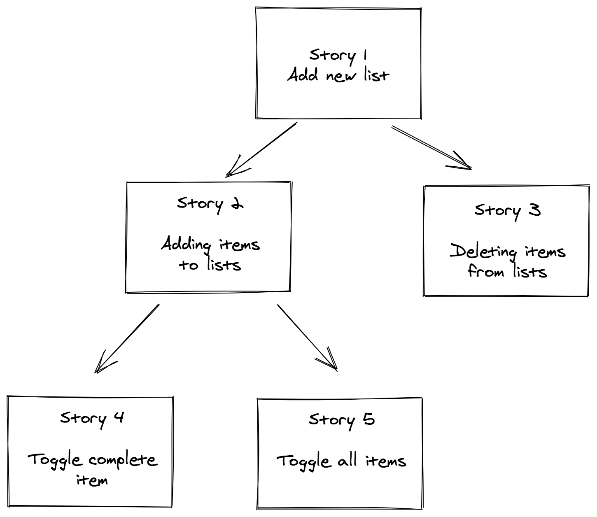

# Development Strategy

> `List-prototype`

## Creating To-do Lists

The aim of the project is to build an app that can create and manage lists. In order to achieve this, we will use HTML / CSS / JavaScript. The project will be developed by using branches and project board on GitHub.

---

## User Story Dependencies

---

## WIREFRAME

---

## 0. Set-Up

> repository owner: [Fatih](https://github.com/fmkarakus)

**As a User I can see an empty site at the correct URL**

**As a fellow developer I can see the prepared repository**

### Repo

1. Generate a new repo
2. Create initial README file
3. Turn on GitHub Pages
4. Add collaborators
5. Prepare a project board

---

## 1. Development Strategy

> assigned to Abel

**As a fellow developer or repo visitor, I want to see how the project will be developed**

### Repository

- developed on a branch called `dev-strategy`

### JS

no changes

### HTML

no changes

### CSS

no changes

### REPO

- Create `development-strategy.md`

---

## 2. HTML & CSS structure

> assigned to Gelila

**As a site visitor, I want to see the website layout and elements**

### Repository

- developed on a branch called `render-css`

### JS

no changes

### HTML

- create `input` element
- div element for each display section

### CSS

- styling of the html document and its body
- styling of the background, inner content and lists

---

## 3. Render list prototype

> _assigned to Gelila_

**As a site visitor, I want to add a To-do List**

### Repository

- developed on a branch called `render-css`

### Handler

- Nothing has changed

### listener

- Nothing has changed

### logic

- Nothing has changed

### views

- create, inside `const listPrototype` object the `render` function that render the new lists

### HTML

- Nothing has changed

### CSS

- Nothing has changed

---

## 4. List prototype Add

> _assigned to Fatih_

**As a site visitor, I want to add items on the lists that I create**

### Repository

- developed on a branch called `add`

### Handler

- Create, inside `const listPrototype` object the `add` function that render the new elements of the list 

### listener

- Add listeners for `button` on the list

### logic

- Nothing has changed

### views

-- create, inside `const listPrototype` object the `renderList` function that render the new items of the list.

### HTML

- Nothing has changed

### CSS

- Nothing has changed

---

## 5. List prototype Delete

> _assigned to Fatih_

**As a site visitor, I want to delete items on the lists that I create**

### Repository

- developed on a branch called `delete`

### Handler

- Create, inside `const listPrototype` object the `delete` function that render the new elements of the list 

### listener

- Add listeners for `icon` on the list item

### logic

- Nothing has changed

### views

-- Edit the `renderList` function that render the new items of the list.

### HTML

- Nothing has changed

### CSS

- Nothing has changed

---

## 6. List prototype Toggle Complete

> _assigned to Abel_

**As a site visitor, I want to check the items on the lists that I have completed**

### Repository

- developed on a branch called `complete`

### Handler

- Create, inside `const listPrototype` object the `complete` function that render the new elements of the list 

### listener

- Add listeners for `li` elements on the lists

### logic

- Nothing has changed

### views

-- Edit the `renderList` function that render the new items of the list.

### HTML

- Nothing has changed

### CSS

- Create the `complete` class.

---

## 7. List prototype Toggle All

> _assigned to Abel_

**As a site visitor, I want to check all the items on the lists that I have completed**

### Repository

- developed on a branch called `toggle-all`

### Handler

- Create, inside `const listPrototype` object the `completeAll` function that render the new elements of the list 

### listener

- Add listeners for `button` elements on the lists

### logic

- Nothing has changed

### views

- Edit the `renderList` function that render the new items of the list.

### HTML

- Create `check all` button

### CSS

- Nothing has changed

---

## 8. Finishing Touches

> assigned to \_

- W3C code validation made
- All bugs and errors were fixed